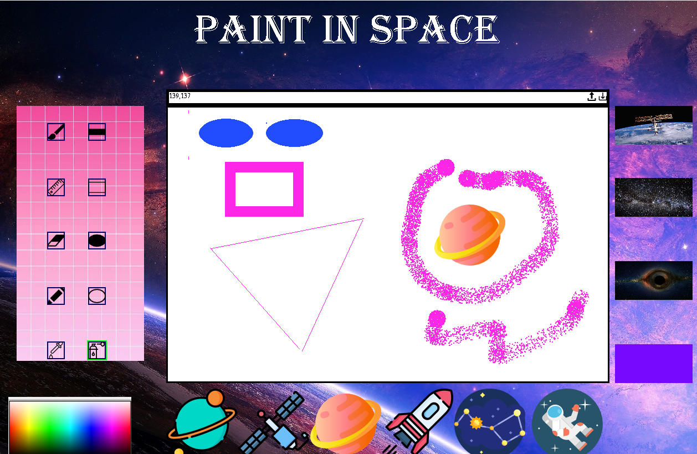

# Paint In Space
A space themed clone of Microsoft Paint made in python using pygame and tkinter.

 

## Set Up
Ensure you have the following installed:
* Python 3
* pygame 2.00 or later

Then, simply download the code and run paint.py

 

## Tools

* Spraypaint

* Highlighter

* Rectangle fill

* Ellipse fill

* Stickers

 

## Demo

